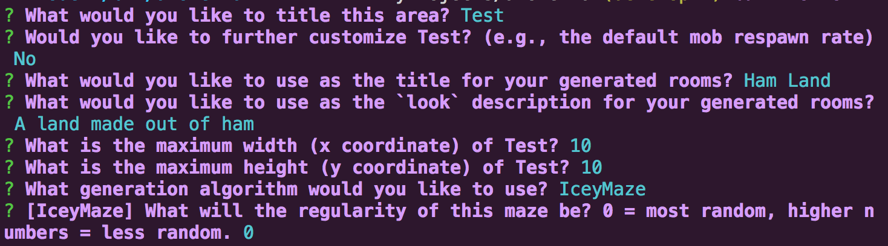

Axolemma
========

##### A tool for procedurally generating Ranvier areas.

--

## How to Install

`npm install --save axolemma`

## How to Use

Axolemma is usable as a CLI tool and can also be used as a library.

To use it as a CLI tool, navigate to the working directory where you would like Axolemma to generate the map files, and type `axolemma`.

Axolemma will ask a series of questions and, as a result, generate an area for you.



Here is a recipe for using Axolemma programmatically:

```javascript
// Require-able like any other library.
const Axolemma = require('axolemma')

const {graphic, rooms, yaml} = Axolemma.generate({ // Programmatically pass in options
  type: 'Digger' // Uses ROT-js well-documented map generation algorithms.
  writeToFile: true // Can write YAML definitions to file for static persistence
})

// Returns an old-school ASCII map of your area.
console.log(graphic)

// Returns YAML string.
console.log(yaml)

// Returns Ranvier-compatible room definitions.
const newRooms = rooms.map(
  roomDef => new Room(roomDef)
);

```

## Configuration

When using Axolemma programmatically (or eventually through the CLI), you can customize the default options using either a `.axolemmaconfig` file or by adding an "axolemma" field in your package.json.

Your `.axolemmaconfig` can be either a JavaScript module or a JSON file. Axolemma will crawl up the directory tree to find the file so it can be in the root directory of your Ranvier bundle, the root of your fork of Ranvier, or even in your user home directory. It will use the 'nearest' config it finds, so you can have multiple configurations at different nesting levels.

Configuration precedence goes as follows:
* Options passed in programmatically
* `.axolemmaconfig` options
* Options from `"axolemma"` field in package.json
* Axolemma's built-in defaults.

Axolemma accepts the following options:
```javascript
/**
  * @typedef {Object} AxolemmaOptions
  * @property {number} [width] The maximum width of the area you'd like to generate (x coordinates). Defaults to 20.
  * @property {number} [height] The maximum height of the area you'd like to generate (y coordinates). Defaults to 20.
  * @property {number} [depth] Unimplemented. The maximum depth (z coordinates or floors) of the area you'd like to generate. Defaults to 0 (2D area).
  * @property {boolean} [writeToFile] Whether to write the YAML result to file or simply return the data. Defaults to false.
  * @property {string} [filepath] Path to write YAML to. Defaults to current working directory
  * @property {string} [areaTitle] Title of area to generate. Defaults to 'Generated Area'
  * @property {Object} [areaInfo] Info object for area manifest. Defaults to object with respawnInterval property set to 60.
  * @property {string} [genericRoomTitle] A title to be used for all of the rooms in your generated area. Defaults to 'An Empty Room'.
  * @property {string} [genericRoomDesc] A description to be used for all of the rooms in your generated area. Defaults to 'There is nothing particularly interesting about this place.'
  * @property {string} [type] The 'type' of map creator to use. This must be the name of a ROT-js Map constructor. Defaults to 'Uniform'.
  * @property {number} [roomDugPercentage] Percentage in decimal of map coordinates to be turned into rooms. Defaults to 0.25 (25%).
  * @property {timeLimit} [number] Amount of ms to wait for the ROT-js map generator algorithms to complete before giving up. Defaults to 60,000 (one minute).
  */
```

## Misc.

Axolemma is currently in an early alpha stage. Use at your own risk.

The areas it generates are incredibly generic in this iteration so much hand-editing is still required.

If you're using this in your Ranvier server to dynamically generate content on the fly, consider using a Cluster or similar to avoid blocking the main process with Axolemma.